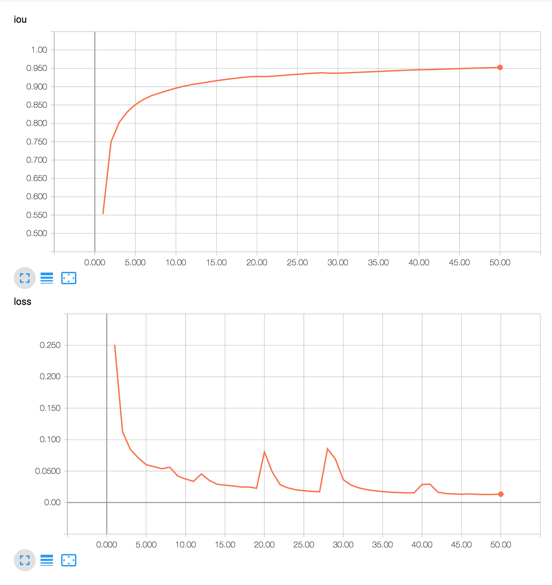
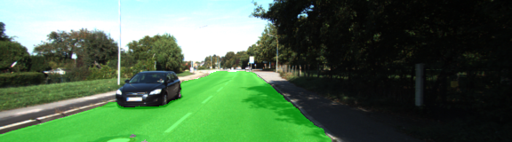
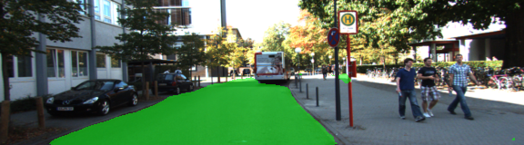

# Semantic Segmentation Project
### Introduction
In this project, I labeled the pixels of a road in images using a Fully Convolutional Network (FCN-8s), in particular the VGG16-based model explained in the paper [Fully Convolutional Networks for Semantic Segmentation](https://people.eecs.berkeley.edu/~jonlong/long_shelhamer_fcn.pdf).

I tried different values of input image size, dropout, learning rate, batch size, number of epochs and random data augmentation and checked the testing set for underfitting and overfitting. I trained using cross entropy loss but also measured the mean IoU after each epoch to better understand the model accuracy.

These were the final selected hyperparameters after hours of training using AWS g3.4large instance:
- Input Image Size (HxW): (160, 768)
- Epochs: 50
- Batch Size: 1
- Learning Rate: 0.0001
- Dropout Keep Probability: 0.8
- Data Augmentation: No

### Training IoU and Loss


### Data augmentation

Data augmentation did not improve model accuracy and created undesired artifacts in the testing set. I believe the transformations I used deformed images to the point they became bad examples of training data, never seen in the test set (e.g. horizontal flipping creates data samples of UK roads, so the model requires more training to generalize). Further work should be done regarding data augmentation to make sure the applied transformations produce images closer to reality.

### Test Samples





### Setup
##### Frameworks and Packages
Make sure you have the following is installed:
 - [Python 3.5](https://www.python.org/)
 - [TensorFlow](https://www.tensorflow.org/)
 - [NumPy](http://www.numpy.org/)
 - [SciPy](https://www.scipy.org/)
 - [OpenCV](https://opencv.org)
##### Dataset
Download the [Kitti Road dataset](http://www.cvlibs.net/datasets/kitti/eval_road.php) from [here](http://www.cvlibs.net/download.php?file=data_road.zip).  Extract the dataset in the `data` folder.  This will create the folder `data_road` with all the training a test images.

### Start
##### Run
Run the following command to run the project:
```
python main.py
```

### Submission
1. Ensure you've passed all the unit tests.
2. Ensure you pass all points on [the rubric](https://review.udacity.com/#!/rubrics/989/view).
3. Submit the following in a zip file.
 - `helper.py`
 - `main.py`
 - `project_tests.py`
 - Newest inference images from `runs` folder
